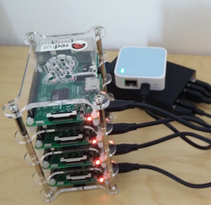

## Ansible 2 Playbooks for Docker / Kubernetes / OpenShift on RaspberryPis 3 - Hypriot flavor



Here are the Ansible playbooks for a Raspberry Pi Cluster running Docker and Kubernetes as described in this [Blog Post](https://ro14nd.de/kubernetes-on-raspberry-pi3). These playbooks require Ansible 2.0 and won't work with Ansible 1.x.

The goals of thise project are
* Using Ansible for not only a one-shot installation but also maintainance and upgrades.
* Using WiFi for connecting the cluster. See below for the reason.
* Get [OpenShift Origin](https://github.com/openshift/origin) running and be able to switch between Kubernetes and OpenShift via Ansible.
* Create a demonstration platform for my favourite development and integration platform [fabric8](http://fabric8.io).

## Shopping List

Here's a shopping list for a Raspberry Pi 3 cluster, along with (non-affiliate) links to (German) shops (as of April 2016), but I'm sure you can find them elswhere, too.

| Amount | Part | Price |
| ------ | ---- | ----- |
| 4 | [Raspberry Pi 3](http://www.watterott.com/de/Raspberry-Pi-3) | 4 * 38 EUR |
| 4 | [Micro SD Card 32 GB](http://www.amazon.de/dp/B013UDL5RU) | 4 * 11 EUR |
| 1 | [WLAN Router](http://www.amazon.de/dp/B00XPUIDFQ) | 22 EUR |
| 4 | [USB wires](http://www.amazon.de/dp/B016BEVNK4) | 9 EUR |
| 1 | [Power Supply](http://www.amazon.de/dp/B00PTLSH9G) | 30 EUR |
| 1 | [Case](http://www.amazon.de/dp/B00NB1WPEE) | 10 EUR |
| 3 | [Intermediate Case Plate](http://www.amazon.de/dp/B00NB1WQZW) | 3 * 7 EUR |

All in all, a 4 node Pi cluster for **288 EUR** (as of April 2016).

Some remarks:

* Using WiFi for the connection has the big advantage that the Raspberry Pi 3 integrated BCM43438 WiFi chip doesn't go over USB and saves valuable bandwidth used for IO in general. That way you are able to to get ~ 25 MB/s for disk IO and network traffic, respectively. And also less cables, of course. You can alway plug the power wire for demos, too ;-)
* Use a class 10 Mirco SD but it doesn't have to be the fastest on the world at the USB bus only allows around 25 MB/s anyway.

## Initial Pi Setup

Most of the installation is automated by using [Ansible](https://www.ansible.com/).
Thanks to [Hypriot](https://github.com/hypriot/image-builder-rpi/releases/latest) images a complete headless setup is possible., but for the moment it  much more stable (I had strange kernel panics and 200% CPU load issues with the Hypriot image for no obvious reasons).

1. Download the latest Hyoriot image and store it as `hypriot.zip` :

        curl -L https://github.com/hypriot/image-builder-rpi/releases/download/v1.4.0/hypriotos-rpi-v1.4.0.img.zip -o hypriot.zip

2. Install Hypriots' [flash](https://github.com/hypriot/flash) installer script. Follow the directions on the installation page.

3. Insert you Micro-SD card in your Desktop computer (via an adapter possibly) and run
```
flash --hostname n0 --ssid "mysid" --password "secret" hypriot.zip
```
   You will be asked to which device to write. Check this carefully, otherwise you could destroy your Desktop OS if selecting the the wrong device. Typically its something like `/dev/disk2` on OS X, but depends on the number of hard drives you have.
4. Repeat step 2. to 3. for each Micro SD card. Please adapt the hostname before each round to **n1**, **n2**, **n3**.

## Network Setup

It is now time to configure your WLAN router. This of course depends on which router you use. The following instructions are based on a [TP-Link TL-WR802N](http://www.tp-link.de/products/details/TL-WR802N.html) which is quite inexepensive but still absolutely ok for our purposes since it sits very close to the cluster and my notebook anyway.

First of all you need to setup the SSID and password. Use the same credentials with which you have configured your images.

My setup is, that I span a private network `192.168.23.0/24` for the Pi cluster which my MacBook also joins via its integrated WiFi.

The addresses I have chosen are :

| IP                                    | Device          |
| ------------------------------------- | --------------- |
| `192.168.23.1`                        | WLAN Router     |
| `192.168.23.100`                      | MacBook's WLAN  |
| `192.168.23.200` ... `192.168.23.203` | Raspberry Pis   |

The MacBook is setup for NAT and forwarding from this private network to the internet. This [script](https://github.com/Project31/ansible-kubernetes-openshift-pi3/blob/master/tools/setup_nat_on_osx.sh) helps in setting up the forwarding and NAT rules on OS X.

In order to configure your WLAN router you need to connect to it according to its setup instructions. The router is setup in **Access Point** mode with DHCP enabled. As soon as the MAC of the Pis are known (which you can see as soon as they connect for the first time via WiFi), I configured them to always use the same DHCP lease. For the TL-WR802N this can be done in the configuration section *DHCP -> Address Reservation*. In the *DHCP -> DHCP-Settings* the default gateway is set to `192.168.23.100`, which my notebook's WLAN IP.

Startup all nodes, you should be able to ping every node in your cluster. I added `n0` ... `n3` to my notebook's `/etc/hosts` pointing to `192.168.23.200` ... `192.168.23.203` for convenience.

You should be able to ssh into every Pi with user *pirate* and password *hypriot*. Also, if you set up the forwarding on your desktop properly you should be able to ping from within the pi to the outside world. Internet access from the nodes is mandatory for setting up the nodes with Ansible

## Ansible Playbooks

After this initial setup is done, the next step is to initialize the base system with Ansible. You will need Ansible 2 installed on your desktop (e.g. `brew install ansible` when running on OS X)

### Ansible Configuration

1. Checkout the Ansible playbooks:

        git clone https://github.com/Project31/ansible-kubernetes-openshift-pi3.git k8s-pi
        cd k8s-pi

2. Copy over `hosts.example` and adapt it to your needs

        cp hosts.example hosts
        vi hosts

   There are three groups:

   * **pis** contains all members of your cluster where one is marked as "master" in the field `host_extra`. This group will be added to every node in its `/etc/hosts`. **It is important that one host is marked as "master", since the playbooks rely on this host alias for accessing the API server**.
   * **master** IP address of the Master
   * **nodes** All nodes which are not Master

3. If required, copy over the configuration and adapt it:

        cp config.yml.example config.yml
        vi config.yml

### Init machine-id

Because of a pecularity of Hypriot OS 1.4 which causes every machine id to be the same,
`/etc/machine-id` need to be initialized once for each node. This is required later e.g. by
the Weave overlay network as it calculates its virtual Mac address from this datum.

To do so, call the following Ansible ad-hoc command:

```
ansible pis -u pirate -k -i hosts --become -m shell --args "dbus-uuidgen > /etc/machine-id"
```

Use "hypriot" as password here. You can also use the script `tools/init_machine_id.sh`

### Basic Node Setup

If you have already created a cluster with these playbooks and want to start a fresh, please be sure that you cleanup your `~/.ssh/known_hosts` from the old host keys. The script `tools/cleanup_known_hosts.sh` can be used for this. You should be able to ssh into each of the nodes without warnings. Also you must be able to reach the internet from the nodes.

In the next step the basic setup (without Kubernetes) is performed. This is done by

    ansible-playbook -k -i hosts setup.yml

When you are prompted for the password, use *hypriot*. You will probably also need to confirm the SSH authentity for each host with *yes*.

The following steps will be applied by this command (which may take a bit):

* Docker will be installed from the Hypriot repositories
* Your public SSH key `.ssh/id_rsa.pub` is copied over to *pi's* authenticated_keys and the users password will be taken from `config.yml`
* Some extra tools are installed for your convenience and some benchmarking:
  - hdparm
  - iperf
  - mtr
* Hostname is set to the name of the node configured. Also `/etc/hosts` is setup to contain all nodes with their short names.
* A swapfile is enabled (just in case)

With this basic setup you have already a working Docker environment.

**Now its time to reboot the whole cluster since some required boot params has been added. Plug the wire.**

### Kubernetes Setup

The final step for a working Kubernetes cluster is to run

    ansible-playbook -i hosts kubernetes.yml

This will install one master at n0 and threed additional nodes n1, n2, n3 with the help of [kubeadm](http://kubernetes.io/docs/getting-started-guides/kubeadm/)

In addition this playbook does the following:

* Creates a token in `run/kubeadm-token.txt` if not done already and use it for installing master and nodes
* Installs kubectl and an alias `k`
* Creates a `run/pi-cluster.cfg` which can be used for `kubectl` on the local host to access the pi cluster's master. Either use `kubectl --kubeconfig run/pi-cluster.cfg` or set the environment variable `export KUBECONFIG=$(pwd)/run/pi-cluster.cfg`

The initial installation may take a bit until all infrastructure docker images has been pulled from the registry. Eventually you should be able to use `kubectl get nodes` from e.g. `n0` or from the localhost (if you set the config as described above).

### Full Kubernetes reset

In case you need a [full cleanup](http://stackoverflow.com/a/41372829/207604) of the Kubernetes setup, use:

    ansible-playbook -i hosts kubernetes-full-reset.yml

This is also needed in case you want to change one of the Pod or Services subnets.

### Tools

In the `tools/` directory you find some useful scripts:

* `cleanup_known_hosts.sh` for removing the entries for n0, n1, n2 and n3 in `~/.ssh/known_hosts` in case you want to completely reinstall the cluster
* `setup_nat_on_osx.sh` switches on NAT so that the cluster can reach the Internet for loading the required images. Call it without arguments for usage informations
* `setup_nat_off_osx.sh` switches off NAT again.
* `halt_pis.sh` stop the cluster (needs still a bit of tuning)
* `reboot_pis.sh` reboot the cluster (needs still a bit of tuning)

### Next steps ...

For the future we plan the following features to add:

* Volume support
* Registry
* Ingress Controller based on traefik
* OpenShift support

### Acknowledgements

Thanks to Sergio Sisternes for the inspiration to switch to `kubeadm` which makes things much easier and the manual setup of `etcd` and `flanneld` superfluous.
